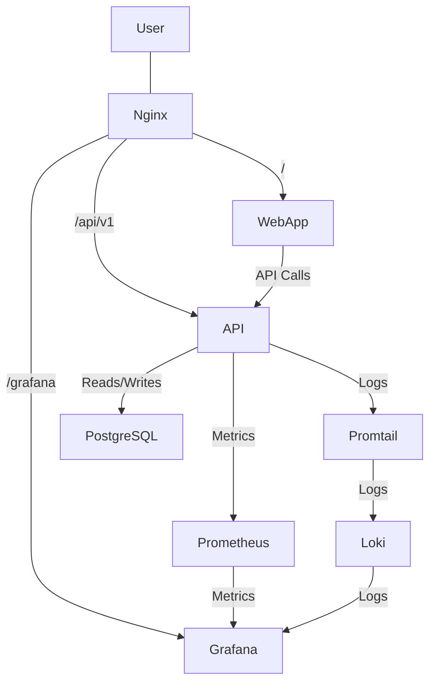

# Visão Geral da Arquitetura do Sistema SaaS Chatbot AI

Este documento descreve a arquitetura geral do sistema SaaS Chatbot AI, que é uma aplicação conteinerizada e orquestrada usando Docker Compose. O sistema é composto por três componentes principais: a API de backend (FastAPI), a aplicação web de frontend (Next.js) e uma infraestrutura de monitoramento robusta.

## Componentes Principais

### 1. API de Backend (`apps/api`)

*   **Tecnologia**: Desenvolvida com **FastAPI** (Python), oferece todos os endpoints necessários para a funcionalidade do chatbot, autenticação de usuários, gerenciamento de workspaces, conversas e mensagens.
*   **Estrutura**:
    *   `app/main.py`: Ponto de entrada da aplicação, responsável pela inicialização do FastAPI, configuração de middlewares (CORS), e inclusão dos roteadores da API.
    *   `app/api/v1/`: Contém os roteadores específicos para cada domínio (autenticação, chats, workspaces, administração).
    *   `app/core/`: Módulos centrais para configuração (`config.py`), banco de dados (`db.py`), segurança (`security.py`), e métricas (`metrics.py`, `metrics_setup.py`, `database_setup.py`).
    *   `app/models/`: Definições dos modelos de dados usando SQLModel.
    *   `app/schemas/`: Definições dos schemas de validação e serialização de dados (Pydantic).
    *   `app/services/`: **Nova camada de serviços** que encapsula a lógica de negócios, desacoplando-a dos roteadores da API. Inclui `AuthService`, `ChatService`, `WorkspaceService` e `AdminService`.
*   **Baixo Acoplamento**: A refatoração recente introduziu uma camada de serviços (`app/services/`) para centralizar a lógica de negócios. Isso significa que os roteadores da API (`app/api/v1/`) agora são mais "magros", focando apenas na validação de entrada e na delegação de tarefas para os serviços apropriados. Isso melhora a manutenibilidade, testabilidade e flexibilidade do código.
*   **Métricas e DB**: A configuração das métricas Prometheus e a inicialização do banco de dados foram movidas para módulos dedicados (`metrics_setup.py` e `database_setup.py` respectivamente), tornando `main.py` mais limpo e focado na orquestração.

### 2. Aplicação Web de Frontend (`apps/web`)

*   **Tecnologia**: Desenvolvida com **Next.js** (React/TypeScript), fornece a interface do usuário para os clientes interagirem com o chatbot, gerencia suas conversas e acessa as funcionalidades administrativas.
*   **Estrutura**:
    *   `app/`: Contém as páginas da aplicação (dashboard, login, registro, admin) e as rotas de API do Next.js.
    *   `components/`: Componentes React reutilizáveis.
    *   `public/`: Ativos estáticos.
*   **Comunicação**: Interage com a API de Backend para todas as operações de dados, utilizando as rotas de API do Next.js como um proxy ou diretamente.

### 3. Infraestrutura de Monitoramento (`infra`)

*   **Componentes**:
    *   **Nginx**: Atua como um reverse proxy para a API, a aplicação web e o Grafana. Configurado para lidar com subcaminhos (`/grafana/`) e WebSockets para funcionalidades em tempo real.
    *   **Grafana**: Plataforma de visualização de dados para métricas e logs. Dashboards e fontes de dados são provisionados automaticamente.
    *   **Prometheus**: Coleta métricas da API de Backend e de outros serviços (ex: `redis-exporter`).
    *   **Loki**: Sistema de agregação de logs.
    *   **Promtail**: Agente de coleta de logs que roda como um contêiner sidecar, descobrindo e enviando logs de todos os outros contêineres Docker para o Loki. Esta abordagem substituiu o uso do driver de log do Docker, oferecendo maior robustez e desacoplamento.
*   **Vantagens do Promtail**: A transição para o Promtail garante que a coleta de logs seja mais resiliente. Se o Loki estiver temporariamente indisponível, o Promtail armazena os logs em buffer e os envia quando o Loki estiver de volta, evitando a falha de inicialização de outros serviços que dependiam do driver de log do Docker. Além disso, facilita a portabilidade para diferentes ambientes.

### 4. Banco de Dados (PostgreSQL)

*   **Tecnologia**: Utiliza **PostgreSQL** como sistema de gerenciamento de banco de dados relacional.
*   **ORM**: A API de Backend interage com o banco de dados através do **SQLModel**, um ORM (Object-Relational Mapper) que combina SQLAlchemy e Pydantic, facilitando a definição de modelos de dados e a interação com o banco.
*   **Modelos**: Os modelos de dados (ex: `User`, `Workspace`, `Conversation`, `Message`) são definidos em `apps/api/app/models/`, refletindo a estrutura das tabelas no banco de dados.

## Diagrama de Alto Nível

## Fluxo de Dados Simplificado

1.  O usuário acessa a aplicação web através do Nginx.
2.  A aplicação web faz requisições à API de Backend (via Nginx) para autenticação, gerenciamento de dados e interação com o chatbot.
3.  A API processa as requisições, interage com o banco de dados (PostgreSQL) e, se necessário, com serviços de LLM externos (não mostrados no diagrama de alto nível).
4.  Tanto a API quanto outros serviços Docker geram logs, que são coletados pelo Promtail e enviados para o Loki.
5.  A API também expõe métricas, que são coletadas pelo Prometheus.
6.  O Grafana consome dados do Prometheus (métricas) e do Loki (logs) para fornecer uma visão unificada do estado e desempenho do sistema.

## Principais Alterações e Refatorações Recentes

Durante o processo de depuração e otimização, as seguintes alterações significativas foram implementadas:

1.  **Refatoração da API para Baixo Acoplamento**:
    *   Introdução de uma **camada de serviços** (`apps/api/app/services/`) para encapsular a lógica de negócios, desacoplando-a dos roteadores da API. Isso resultou na criação de `AuthService`, `ChatService`, `WorkspaceService` e `AdminService`.
    *   A configuração das métricas Prometheus e a inicialização do banco de dados foram movidas para módulos dedicados (`apps/api/app/core/metrics_setup.py` e `apps/api/app/core/database_setup.py`), simplificando o `apps/api/app/main.py`.

2.  **Transição para Promtail para Coleta de Logs**:
    *   Substituição do driver de log do Docker (`loki-driver`) pelo **Promtail** para coletar logs de todos os contêineres e enviá-los para o Loki.
    *   **Vantagens**: Maior robustez (Promtail armazena logs em buffer se o Loki estiver indisponível), melhor desacoplamento (serviços não dependem diretamente do Loki para iniciar) e maior portabilidade.
    *   O arquivo `setup-monitoring.bat` tornou-se obsoleto e foi removido.

3.  **Correções na Configuração do Grafana**:
    *   Adição de `uid`s estáticos às fontes de dados do Grafana (`infra/grafana/datasources/datasources.yml`) para garantir a persistência das referências em dashboards e alertas.
    *   Atualização da sintaxe das regras de alerta do Grafana (`infra/grafana/alerting/alert-rules.yml`) para o formato `conditions` mais recente.

4.  **Correções na Configuração do Nginx**:
    *   Ajuste na configuração de `proxy_pass` para o Grafana (`infra/nginx/default.conf`) para resolver o problema de "ERR_TOO_MANY_REDIRECTS".
    *   Adição de suporte a WebSockets para o Grafana Live (`infra/nginx/default.conf`).

5.  **Correção de Permissões do Loki**:
    *   Ajuste no `docker-compose.prod.yml` para executar o serviço Loki como `user: root` para resolver problemas de permissão de escrita em `/tmp/loki/rules`.

6.  **Remoção do Healthcheck do Redis Exporter**:
    *   Remoção do healthcheck do `redis-exporter` em `docker-compose.prod.yml`, pois ele dependia de `wget`, que não estava presente na imagem leve do contêiner.

## Implantação e Orquestração

O sistema é conteinerizado e orquestrado usando **Docker Compose**, conforme definido no arquivo `docker-compose.prod.yml`. Este arquivo descreve todos os serviços, suas dependências, volumes, redes e configurações de ambiente, permitindo que a aplicação seja facilmente implantada e executada em qualquer ambiente que suporte Docker.

*   **Serviços**: Cada componente principal (API, Web, Nginx, Grafana, Prometheus, Loki, Promtail, PostgreSQL) é definido como um serviço separado no `docker-compose.prod.yml`.
*   **Volumes**: Utilizados para persistir dados do banco de dados, configurações de monitoramento e logs, garantindo que os dados não sejam perdidos quando os contêineres são reiniciados ou removidos.
*   **Redes**: Os serviços se comunicam através de uma rede Docker interna, isolando-os da rede do host e permitindo comunicação segura entre eles.
*   **Variáveis de Ambiente**: As configurações sensíveis e específicas do ambiente são gerenciadas através de variáveis de ambiente, que podem ser definidas em um arquivo `.env` (não versionado) para facilitar a configuração em diferentes ambientes.
